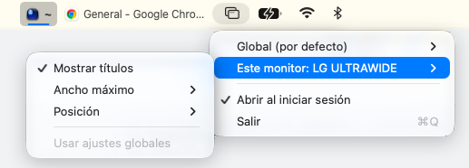

# WindowMenu

Barra de tareas estilo Windows en la barra de menús de macOS: cada ventana del monitor/Space activo aparece como un botón (icono + título).



- **Ventana con foco:** fondo resaltado, título en negrita y una rayita de color de acento.
- **Clic en una ventana:** la enfoca. Clic en la activa: la minimiza. Clic en una minimizada (atenuada): la restaura.
- **Orden estable:** los botones no cambian de sitio al cambiar el foco.
- **Clic derecho:** mostrar/ocultar títulos, ancho máximo, abrir al iniciar sesión, salir.

## Instalar
```bash
curl -fsSL https://raw.githubusercontent.com/escorponox/WindowMenu/main/install.sh | bash
```
Descarga la última release, la deja en `/Applications` y la abre. Requiere macOS 13+.

También puedes bajar `WindowMenu.zip` desde [Releases](https://github.com/escorponox/WindowMenu/releases). La app no está notarizada, así que si la descargas con el navegador macOS dirá que está dañada; quítale la marca de cuarentena:
```bash
xattr -dr com.apple.quarantine /Applications/WindowMenu.app
```

## Actualizaciones
WindowMenu busca una versión nueva al arrancar y una vez al día. Si la hay, en el menú aparece **Actualizar a la vX.Y.Z**: la descarga, la instala y se reinicia. **Buscar actualizaciones…** lo comprueba en el momento.

Solo instala versiones firmadas con el mismo certificado que la que tienes, así que una app compilada en local con `./build.sh` (firma ad-hoc) no se puede actualizar desde el menú: reinstálala con el script.

## Permisos
- **Accesibilidad** (obligatorio): Ajustes del Sistema → Privacidad y seguridad → Accesibilidad.
- Las releases están firmadas siempre con el mismo certificado, así que el permiso se conserva al actualizar.
- Las compilaciones locales con firma ad-hoc cambian de firma cada vez: si deja de funcionar, quítala de la lista de Accesibilidad y vuelve a añadirla.

## Compilar
```bash
./build.sh
mv WindowMenu.app /Applications/ && open /Applications/WindowMenu.app
```
Requiere Xcode o las Command Line Tools (`xcode-select --install`). Con `SIGN_IDENTITY="WindowMenu Signing" ./build.sh` se firma con el certificado de las releases (si lo tienes en el llavero).

## Publicar una versión
Una sola vez, crea el certificado autofirmado y súbelo a los secrets del repo (necesita `gh` y OpenSSL):
```bash
./scripts/create-signing-cert.sh
```
Guarda el `.p12` y su contraseña: si se pierde, las apps instaladas no aceptarán las nuevas versiones.

Después, cada versión es un tag:
```bash
git tag v1.0.0 && git push origin v1.0.0
```
El workflow `.github/workflows/release.yml` compila, firma y publica `WindowMenu.zip` en la release.

## Notas
- **Una barra por monitor**, cada una con las ventanas de ese monitor en su Space actual. Es un panel flotante colocado sobre la barra de menús, entre los menús de la app y los iconos de la derecha (se adapta al notch).
- El icono ▢ de la barra de menús abre los ajustes: títulos, ancho máximo, posición (junto a los iconos o junto a los menús), inicio de sesión y salir. También con clic derecho sobre la barra.
- No aparece sobre apps a pantalla completa ni cuando la barra de menús está oculta automáticamente.
